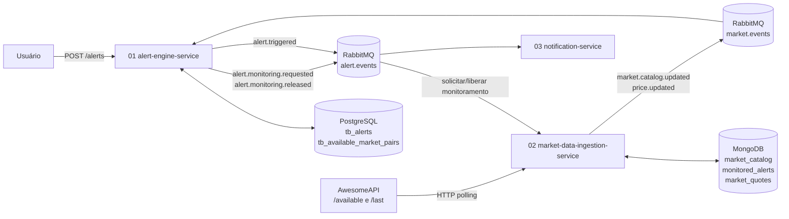
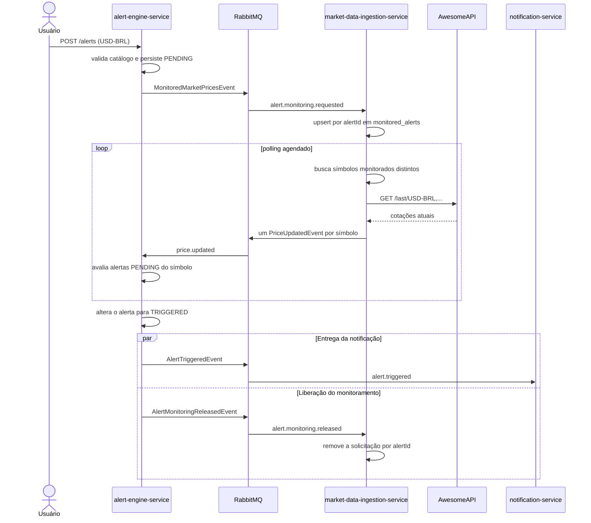

# FinAlert — Documentação de Arquitetura da Solução

## 1. Visão Geral do Sistema
O **FinAlert** é uma plataforma orientada a eventos (*Event-Driven Architecture*) projetada para monitorar cotações de ativos financeiros em tempo real e disparar notificações automáticas aos usuários quando limites de preço pré-configurados forem atingidos.

A arquitetura foi estruturada em microsserviços desacoplados, priorizando resiliência, baixa latência de processamento e escalabilidade independente.

---

## 2. Visão de Arquitetura de Microsserviços

O sistema é composto por três microsserviços principais e componentes de infraestrutura de mensageria e persistência:



O catálogo de pares válidos é obtido exclusivamente pelo `02-market-data-ingestion-service`. O `01-alert-engine-service` mantém uma projeção local desse catálogo para validar `POST /alerts` sem consultar a AwesomeAPI ou o banco de outro serviço.

Quando um alerta é criado, o `01-alert-engine-service` solicita o monitoramento do símbolo por meio de `MonitoredMarketPricesEvent`. O `02-market-data-ingestion-service` mantém uma projeção local das solicitações ativas e usa os símbolos distintos dessa projeção em cada polling.

Quando o alerta é disparado ou cancelado, o `01-alert-engine-service` publica `AlertMonitoringReleasedEvent`. A solicitação correspondente é removida da projeção; o símbolo deixa de ser consultado somente quando não existir outra solicitação ativa para ele.

### 2.1. Sequência do ciclo de vida de um alerta



---

## 3. Descrição dos Microsserviços

### 3.1. `02-market-data-ingestion-service`
* **Papel:** Ingestão contínua de dados de mercado.
* **Mecanismo:** Executa consultas periódicas (*Polling*) via protocolo HTTP REST a APIs públicas de mercado utilizando o recurso `@Scheduled` do Spring Framework.
* **Fluxo de Dados:**
  1. Atualiza periodicamente o catálogo de pares disponíveis via `GET /json/available`.
  2. Persiste o catálogo e a última cotação conhecida no MongoDB (`market_catalog` e `market_quotes`).
  3. Publica `CatalogUpdatedEvent` quando uma nova versão do catálogo é obtida.
  4. Consome `MonitoredMarketPricesEvent` e `AlertMonitoringReleasedEvent` para manter a projeção `monitored_alerts`.
  5. Obtém dessa projeção os símbolos que possuem pelo menos uma solicitação ativa.
  6. Consulta a cotação desses símbolos via `GET /json/last/{symbols}`.
  7. Persiste cada última cotação e publica um `PriceUpdatedEvent` por símbolo atualizado.

### 3.2. `01-alert-engine-service`
* **Papel:** Core de negócios e avaliação de regras de alertas.
* **Mecanismo:** Gerencia o cadastro de alertas via interface REST (Swagger) e processa de forma assíncrona as variações de preço consumidas da mensageria.
* **Fluxo de Dados:**
  1. Consome `CatalogUpdatedEvent` e atualiza a projeção `tb_available_market_pairs` no PostgreSQL.
  2. Expõe endpoints para criação e consulta de regras de alertas de preços (`POST /alerts`, `GET /alerts`).
  3. Valida o símbolo solicitado contra sua projeção local antes de persistir a regra.
  4. Publica `MonitoredMarketPricesEvent` quando um alerta passa a exigir monitoramento.
  5. Consome o evento `PriceUpdatedEvent`.
  6. Avalia as condições ativas (ex: `Preço Atual >= Preço Alvo`).
  7. Atualiza o status da regra para evitar disparos duplicados e publica `AlertTriggeredEvent`.
  8. Publica `AlertMonitoringReleasedEvent` quando o alerta é disparado ou cancelado.

### 3.3. `03-notification-service`
* **Papel:** Entrega de notificações aos usuários.
* **Mecanismo:** Consumidor reativo responsável por transformar eventos de alerta em mensagens finais de comunicação.
* **Fluxo de Dados:**
  1. Consome o evento `AlertTriggeredEvent`.
  2. Formata o modelo do e-mail/mensagem com os dados do evento.
  3. Realiza o envio da notificação via SMTP (`JavaMailSender`) ou canal alternativo (ex: Telegram Bot API).

---

## 4. Design de Eventos e Mensageria

O desacoplamento entre os serviços é garantido pelo uso de um broker de mensagens (**RabbitMQ**).

### 4.1. Evento: `CatalogUpdatedEvent`
* **Produtor:** `02-market-data-ingestion-service`
* **Exchange:** `market.events`
* **Routing key:** `market.catalog.updated`
* **Consumidor:** `01-alert-engine-service`, na fila própria `alert-engine.instrument-catalog`.
* **Semântica:** carrega um snapshot versionado do catálogo de pares válidos. O consumidor faz upsert dos pares recebidos, remove pares ausentes e registra a versão aplicada. O processamento deve ser idempotente.
* **Payload:**
```json
{
  "eventId": "426c7962-d29e-4fa1-9d6c-294fb15e8f48",
  "catalogVersion": 3,
  "generatedAt": "2026-10-01T10:00:00Z",
  "pairs": [
    {
      "symbol": "USD-BRL",
      "description": "Dólar Americano/Real Brasileiro"
    },
    {
      "symbol": "BTC-BRL",
      "description": "Bitcoin/Real Brasileiro"
    }
  ]
}
```

### 4.2. Evento: `MonitoredMarketPricesEvent`
* **Produtor:** `01-alert-engine-service`
* **Exchange:** `alert.events`
* **Routing key:** `alert.monitoring.requested`
* **Consumidor:** `02-market-data-ingestion-service`, na fila própria `monitored-price-alert`.
* **Semântica:** informa que um alerta ativo passou a exigir a coleta de preço de determinado símbolo. O consumidor faz upsert por `alertId`, tornando o processamento idempotente.
* **Payload:**
```json
{
  "eventId": "9296af84-0c44-43df-9b61-62d8534ecddd",
  "alertId": "8f8373b0-2b1b-4f81-80d5-12a8a7051b9e",
  "symbol": "USD-BRL",
  "targetValue": 5.6000,
  "triggerOperator": "GTE",
  "occurredAt": "2026-10-02T10:00:00Z"
}
```

### 4.3. Evento: `AlertMonitoringReleasedEvent`
* **Produtor:** `01-alert-engine-service`
* **Exchange:** `alert.events`
* **Routing key:** `alert.monitoring.released`
* **Consumidor:** `02-market-data-ingestion-service`, na fila própria `market-data.alert-monitoring-released`.
* **Semântica:** informa que um alerta deixou de exigir coleta de preço. O consumidor remove a projeção pelo `alertId`; a remoção repetida deve ser inofensiva.
* **Payload:**
```json
{
  "eventId": "63de2270-cb0f-4825-b06b-70615bd8ae38",
  "alertId": "8f8373b0-2b1b-4f81-80d5-12a8a7051b9e",
  "symbol": "USD-BRL",
  "reason": "TRIGGERED",
  "occurredAt": "2026-10-02T10:01:00Z"
}
```

### 4.4. Evento: `PriceUpdatedEvent`
* **Produtor:** `02-market-data-ingestion-service`
* **Exchange:** `market.events`
* **Routing key:** `price.updated`
* **Consumidor:** `01-alert-engine-service`, na fila própria `alert-engine.price-updated`.
* **Semântica:** representa a atualização de um único símbolo. Uma resposta da AwesomeAPI com vários símbolos produz um evento independente para cada cotação.
* **Payload:**
```json
{
  "eventId": "123e4567-e89b-12d3-a456-426614174000",
  "symbol": "USD-BRL",
  "currentPrice": 5.6025,
  "occurredAt": "2026-09-29T10:00:00Z"
}
```

### 4.5. Evento: `AlertTriggeredEvent`
* **Produtor:** `01-alert-engine-service`
* **Exchange:** `alert.events`
* **Routing key:** `alert.triggered`
* **Consumidor:** `03-notification-service`, na fila própria `notification.alert-triggered`.
* **Payload:**
```json
{
  "alertId": "8f8373b0-2b1b-4f81-80d5-12a8a7051b9e",
  "userEmail": "usuario@email.com",
  "symbol": "USD-BRL",
  "targetPrice": 5.6000,
  "triggeredPrice": 5.6025,
  "triggeredAt": "2026-09-29T10:00:01Z"
}
```

---

## 5. Modelagem de Dados

### 5.1. `02-market-data-ingestion-service` (MongoDB)

* **Collection:** `market_catalog`
  * `_id` (String, PK) — valor fixo `current` para o snapshot vigente.
  * `version` (Long)
  * `updated_at` (Instant)
  * `pairs` (Array)
    * `symbol` (String) — por exemplo `USD-BRL`.
    * `description` (String)
* **Collection de projeção:** `monitored_alerts`
  * `_id` (UUID, PK) — identificador do alerta que solicitou o monitoramento.
  * `symbol` (String) — símbolo a ser consultado.
  * `target_value` (Decimal128)
  * `trigger_operator` (String)
  * `registered_at` (Instant)
* **Collection:** `market_quotes`
  * `_id` (String, PK) — símbolo do par.
  * `current_price` (Decimal128)
  * `quoted_at` (Instant)
  * `received_at` (Instant)

`market_catalog` é o snapshot do catálogo interno do serviço de ingestão. `monitored_alerts` é uma projeção derivada dos eventos do `01-alert-engine-service`; ela contém somente os dados recebidos necessários para identificar o alerta e seu monitoramento, sem dados do usuário. O polling consulta os símbolos distintos presentes nessa projeção. Assim, dois alertas para `USD-BRL` geram duas entradas, e a remoção de uma delas não interrompe indevidamente o monitoramento da outra.

`market_quotes` armazena apenas a última cotação de cada par; histórico de cotações, se necessário, deve usar uma collection própria.

### 5.2. `01-alert-engine-service` (PostgreSQL)

Entidade principal mantida no PostgreSQL:

* **Tabela:** `tb_alerts`
  * `id` (UUID, PK)
  * `user_email` (VARCHAR, Not Null)
  * `symbol` (VARCHAR, Not Null) — Ex: `USD-BRL`, `BTC-USD`
  * `target_price` (DECIMAL, Not Null)
  * `status` (VARCHAR, Not Null) — Valores: `PENDING`, `TRIGGERED`, `CANCELLED`
  * `created_at` (TIMESTAMP, Not Null)
  * `updated_at` (TIMESTAMP)

* **Tabela de projeção:** `tb_available_market_pairs`
  * `symbol` (VARCHAR, PK)
  * `description` (VARCHAR, Not Null)
  * `catalog_version` (BIGINT, Not Null)
  * `updated_at` (TIMESTAMP, Not Null)

Essa tabela é alimentada exclusivamente por `CatalogUpdatedEvent`. Ela é uma projeção de leitura local, e não uma fonte de verdade compartilhada entre os serviços.

---

## 6. Pilha Tecnológica e Infraestrutura

* **Linguagem & Framework:** Java 17/21 com Spring Boot 3.x
* **Acesso a Dados:** Spring Data JPA + Hibernate; Spring Data MongoDB
* **Banco de Dados Relacional:** PostgreSQL 15+
* **Banco de Dados Documental:** MongoDB 8+ para o `02-market-data-ingestion-service`
* **Mensageria:** RabbitMQ
* **Documentação de API:** OpenAPI 3 / Swagger UI (`springdoc-openapi`)
* **Conteinerização:** Docker & Docker Compose (para orquestração do ambiente de desenvolvimento local)
